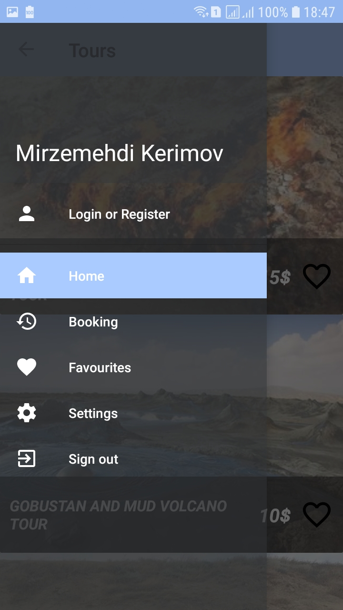
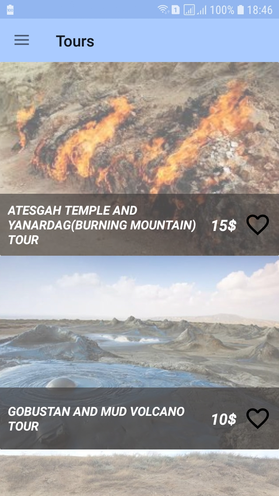

# TapTour
An android app which you can book tours,add to favorites,cancel bookings which you previously booked.This app works both an server app
and client app which when client user book tour server app will get notification about it.

 Some pictures from an app  

  
"  "
"  "

### Installing
apk link:  https://github.com/mirzemehdi/taptour/raw/master/apk/taptour.apk  

## Used Libraries
**Google Volley Library** - For getting datas as an JSON object from MySql database with the help of php also    
**Picasso** - for getting images from url  
**Flat Button** - For user-friend purpose    
**RecylerView** - For showing tousin the list  
**CardView** - in list row  

### More Detail

As an server I used alwaysdata.com. You can see php files in php folder in this project  

## Authors

----Developed by ***Mirzamehdi Karimov***----

